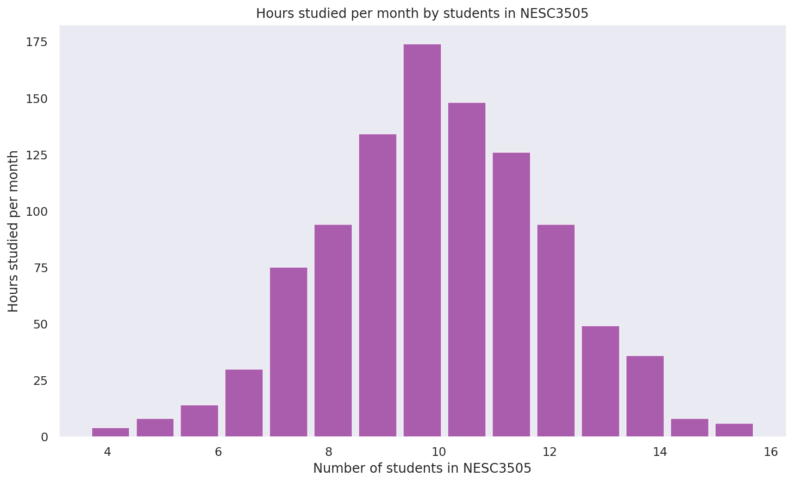
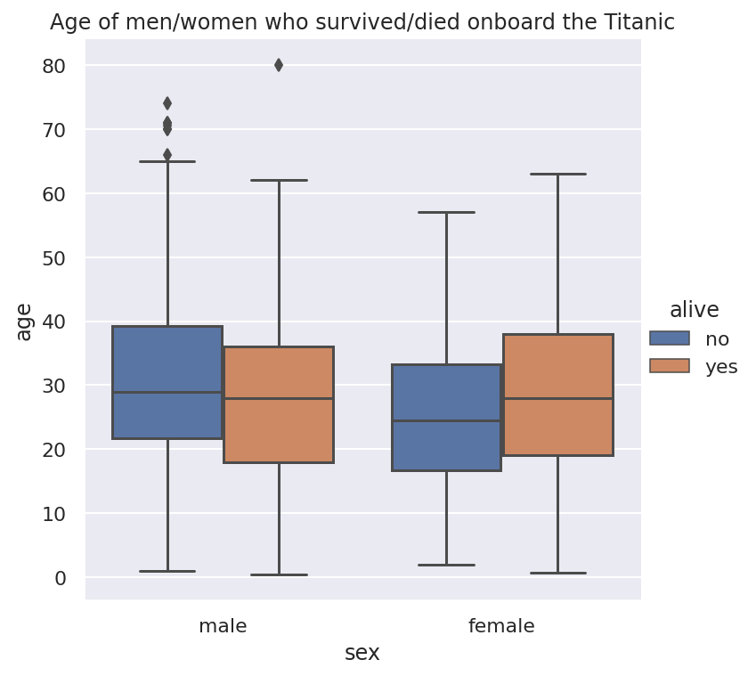

```python
# Importing necessary libraries

import pandas as pd
import numpy as np
import matplotlib.pyplot as plt
import seaborn as sns
```

The following code is using the Python library 'matplotlib'. Matplotlib uses other Python libraries i.e. numpy and pandas, to visualize datasets.


```python
# Generating a random dataset

np.random.seed(1000)
np_hist = np.random.normal(loc = 10, scale = 2, size = 1000)
np_hist[:10]
```


    array([ 8.39108339, 10.64186309,  9.94903424, 11.28864766,  9.39840665,
           10.77894911,  9.7851254 ,  9.04003385, 11.190071  ,  9.07066495])


```python
x.size, y.size
```


    (1000, 11)


```python
# The following data is of my own creation, using the above random dataset

plt.hist(x = np_hist, bins = 15, alpha = 0.6, rwidth = 0.85, color = 'purple')
plt.grid(False)
plt.xlabel('Number of students in NESC3505')
plt.ylabel('Hours studied per month')
plt.title('Hours studied per month by students in NESC3505')

plt.show()
```


    

    


The following code is using the Python library 'Seaborn'. Seaborn has more themes and patterns to choose from than Matplotlib and uses simpler syntax to visualize the data. It is also easier to visualize dataframes in Seaborn as you can overlap various columns within the same graph. 


```python
# The following dataset is a sample data set, pre-loaded from the Internet

titanic = sns.load_dataset('titanic')
titanic
```


<div>

<table border="1" class="dataframe">
  <thead>
    <tr style="text-align: right;">
      <th></th>
      <th>survived</th>
      <th>pclass</th>
      <th>sex</th>
      <th>age</th>
      <th>sibsp</th>
      <th>parch</th>
      <th>fare</th>
      <th>embarked</th>
      <th>class</th>
      <th>who</th>
      <th>adult_male</th>
      <th>deck</th>
      <th>embark_town</th>
      <th>alive</th>
      <th>alone</th>
    </tr>
  </thead>
  <tbody>
    <tr>
      <th>0</th>
      <td>0</td>
      <td>3</td>
      <td>male</td>
      <td>22.0</td>
      <td>1</td>
      <td>0</td>
      <td>7.2500</td>
      <td>S</td>
      <td>Third</td>
      <td>man</td>
      <td>True</td>
      <td>NaN</td>
      <td>Southampton</td>
      <td>no</td>
      <td>False</td>
    </tr>
    <tr>
      <th>1</th>
      <td>1</td>
      <td>1</td>
      <td>female</td>
      <td>38.0</td>
      <td>1</td>
      <td>0</td>
      <td>71.2833</td>
      <td>C</td>
      <td>First</td>
      <td>woman</td>
      <td>False</td>
      <td>C</td>
      <td>Cherbourg</td>
      <td>yes</td>
      <td>False</td>
    </tr>
    <tr>
      <th>2</th>
      <td>1</td>
      <td>3</td>
      <td>female</td>
      <td>26.0</td>
      <td>0</td>
      <td>0</td>
      <td>7.9250</td>
      <td>S</td>
      <td>Third</td>
      <td>woman</td>
      <td>False</td>
      <td>NaN</td>
      <td>Southampton</td>
      <td>yes</td>
      <td>True</td>
    </tr>
    <tr>
      <th>3</th>
      <td>1</td>
      <td>1</td>
      <td>female</td>
      <td>35.0</td>
      <td>1</td>
      <td>0</td>
      <td>53.1000</td>
      <td>S</td>
      <td>First</td>
      <td>woman</td>
      <td>False</td>
      <td>C</td>
      <td>Southampton</td>
      <td>yes</td>
      <td>False</td>
    </tr>
    <tr>
      <th>4</th>
      <td>0</td>
      <td>3</td>
      <td>male</td>
      <td>35.0</td>
      <td>0</td>
      <td>0</td>
      <td>8.0500</td>
      <td>S</td>
      <td>Third</td>
      <td>man</td>
      <td>True</td>
      <td>NaN</td>
      <td>Southampton</td>
      <td>no</td>
      <td>True</td>
    </tr>
    <tr>
      <th>...</th>
      <td>...</td>
      <td>...</td>
      <td>...</td>
      <td>...</td>
      <td>...</td>
      <td>...</td>
      <td>...</td>
      <td>...</td>
      <td>...</td>
      <td>...</td>
      <td>...</td>
      <td>...</td>
      <td>...</td>
      <td>...</td>
      <td>...</td>
    </tr>
    <tr>
      <th>886</th>
      <td>0</td>
      <td>2</td>
      <td>male</td>
      <td>27.0</td>
      <td>0</td>
      <td>0</td>
      <td>13.0000</td>
      <td>S</td>
      <td>Second</td>
      <td>man</td>
      <td>True</td>
      <td>NaN</td>
      <td>Southampton</td>
      <td>no</td>
      <td>True</td>
    </tr>
    <tr>
      <th>887</th>
      <td>1</td>
      <td>1</td>
      <td>female</td>
      <td>19.0</td>
      <td>0</td>
      <td>0</td>
      <td>30.0000</td>
      <td>S</td>
      <td>First</td>
      <td>woman</td>
      <td>False</td>
      <td>B</td>
      <td>Southampton</td>
      <td>yes</td>
      <td>True</td>
    </tr>
    <tr>
      <th>888</th>
      <td>0</td>
      <td>3</td>
      <td>female</td>
      <td>NaN</td>
      <td>1</td>
      <td>2</td>
      <td>23.4500</td>
      <td>S</td>
      <td>Third</td>
      <td>woman</td>
      <td>False</td>
      <td>NaN</td>
      <td>Southampton</td>
      <td>no</td>
      <td>False</td>
    </tr>
    <tr>
      <th>889</th>
      <td>1</td>
      <td>1</td>
      <td>male</td>
      <td>26.0</td>
      <td>0</td>
      <td>0</td>
      <td>30.0000</td>
      <td>C</td>
      <td>First</td>
      <td>man</td>
      <td>True</td>
      <td>C</td>
      <td>Cherbourg</td>
      <td>yes</td>
      <td>True</td>
    </tr>
    <tr>
      <th>890</th>
      <td>0</td>
      <td>3</td>
      <td>male</td>
      <td>32.0</td>
      <td>0</td>
      <td>0</td>
      <td>7.7500</td>
      <td>Q</td>
      <td>Third</td>
      <td>man</td>
      <td>True</td>
      <td>NaN</td>
      <td>Queenstown</td>
      <td>no</td>
      <td>True</td>
    </tr>
  </tbody>
</table>
<p>891 rows × 15 columns</p>
</div>


```python
sns.catplot(kind = 'box', data = titanic, y='age', x= 'sex', hue = 'alive')
plt.title('Age of men/women who survived/died onboard the Titanic')

plt.show()
```


    

    


