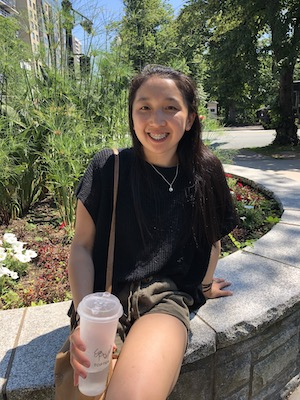

Hi! Welcome to my website, created for my Neural Data Science course (NESC3505). My name is Ani and I am in my third year of Neuroscience at Dalhousie University.

As a beginner to programming, Python originally seemed impossible. This portfolio will showcase some beginner Python code that I found extremely useful for this course.

Included in this website, you will find code on:
Basic Python tools,
Manipulating, Merging and Managing DataFrames
Visualizations i.e. graphs

Here is an example of [reading in a csv file](reading_files.md)

Here are some basic examples of [creating functions](converting.md) 
Although the examples are not the most efficient use of Python, I gained an appreciation for functions and realized that functions are an incredibly useful tool in a variety of situations! 

Here are two ways of graphing data, using [matplotlib and seaborn libraries](Portfolio_work.md)

If you have any questions, please email me at:
[an648648@dal.ca]

[portfolio](Portfolio_work.md)
