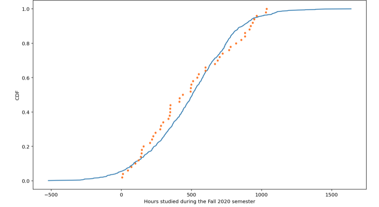

## Plotting probabilities

The empirical cumulative distribution function (ECDF) is used to plot cumulative probabilities. The S-shape graph that results from this plot is due to the fact that each datapoint is summative with the one before it. The ECDF plot is based on data, for example, a known array. It is then plotted against a theoretical sample of a normal function for comparison.


```python
import numpy as np
import matplotlib.pyplot as plt
```

A random array is generated. For the purposes of this example, the data array is 'Hours studied during the Fall 2020 semester', beginning in July 2020 and ending December 18, 2020. This is theoretical data, but likely not far from the truth!


```python
np.random.seed(1000)
np_hist = np.random.randint(1100, size = 120)
array = np_hist[:50]
array
```


    array([ 599,   71,  350,  769,  552,  348,  219,  700,  493,  495,  298,
            937,  228,  498,  344,  882,  414,  244,  205,  722,  668,  138,
             11,  948,  416,  818,  277,  282,  100, 1031,  144,  855,  348,
            881,  512,  158,  914,  686,  923,   47,  335,  145,  965,  541,
            779, 1036,    5,  123,  439,  600])


This function is taken from DataCamp and is used to define the ecdf function in order to plot an ecdf graph.


```python
def ecdf(data):
    n = len(data)
    x = np.sort(data)
    y = np.arange(1, n + 1) / n
    return x, y
```

The mean and standard deviation are calculated for the array.


```python
mean = np.mean(array)
standard_dev = np.std(array)
```

A sample of the normal distribution is taken for comparison with the ECDF plot


```python
normal = np.random.normal(mean, standard_dev, 1000)
```

A Cumulative Distribution Function (CDF) is the cumulative expected probability of obtaining a certain value. This is why we call x_theor and y_theor for theoretical x and theoretical y.

The regular x and y are defined by the random array of interest.


```python
x_theor, y_theor = ecdf(normal)
x, y = ecdf(array)
```

Plotting the CDF data against ECDF data. 


```python
_ = plt.plot(x_theor, y_theor)
_ = plt.plot(x, y, marker='.', linestyle='none')
_ = plt.xlabel('Hours studied during the Fall 2020 semester')
_ = plt.ylabel('CDF')
plt.show()
```


    

    
ECDF (observed) data are the orange dots in the graph, while the CDF (theoretical) normal curve is in blue. Observed values are close to normal, however, further statistical analysis is required to confirm significance.

This information was learned from DataCamp lesson: Statistical Thinking in Python (Part 1)

